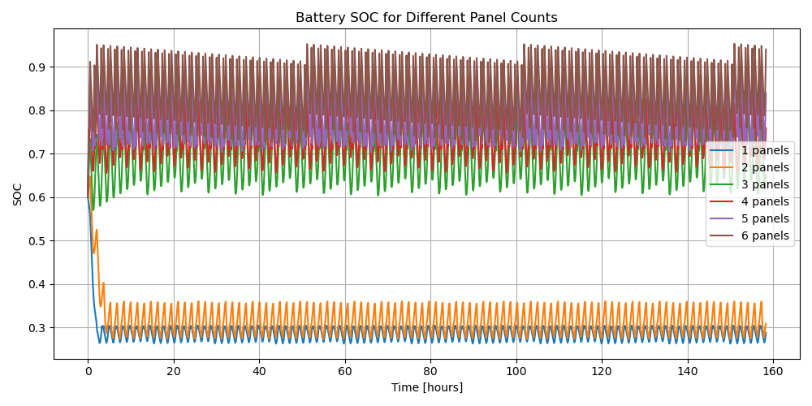
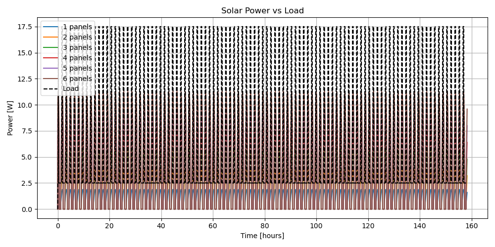

# CubeSat Electrical Power Subsystem (EPS) Simulation

This repository contains a time-domain simulation of a CubeSat Electrical Power Subsystem (EPS).
The simulation models solar power generation, battery state-of-charge (SOC) dynamics,
spacecraft power loads, and energy-aware operational logic over orbital day–night cycles.

The project is intended as a system-level study of EPS behavior rather than a component-level
circuit simulation.

---

## Objectives

- Simulate EPS energy balance over one or more orbits
- Analyze battery SOC evolution under sunlight and eclipse
- Study the effect of varying the number of solar panels
- Evaluate energy margins for nominal operation and communication events

---

## Features

- Orbital sunlight and eclipse modeling
- Solar power generation based on panel count
- Battery SOC dynamics with charge and discharge efficiency
- Nominal and reduced power load profiles
- Net power and SOC visualization
- Parametric study of SOC vs number of solar panels

---

## Simulation Overview

At each time step, the simulator computes:

- Solar power input based on orbital position
- Spacecraft power consumption
- Net power available to charge or discharge the battery
- Updated battery state-of-charge

The simulation captures expected EPS behavior such as SOC decay during eclipse
and recovery during sunlight.

---

## Example Outputs

- Solar power and load vs orbital angle
- Battery SOC vs orbital angle
- Net power balance vs orbital angle
- Minimum SOC vs number of solar panels

These plots are used to assess EPS sizing and operational feasibility.

---

## Assumptions

- Circular Low Earth Orbit (LEO)
- Fixed solar panel orientation
- Lumped battery model
- Ideal power conversion (no DC-DC losses)
- Thermal effects neglected

These assumptions are intentionally simple to focus on system-level energy flow.

---
-----
## Key Results and Analysis

### Single-Orbit EPS Behavior
The following figure shows EPS behavior over a single orbit for a
representative configuration (4 solar panels). It captures solar power
generation, load demand, battery SOC evolution, and net power balance,
with eclipse periods highlighted.


Key observations:
- Solar power drops to zero during eclipse
- Battery SOC decreases in eclipse and recovers in sunlight
- Net power is negative during eclipse and positive during sunlit phases
- SOC remains above the defined safe threshold

---

### Battery SOC Over Time for Different Panel Counts
This plot shows long-term battery SOC evolution over multiple orbits for
different numbers of solar panels.



Key observations:
- Configurations with fewer panels experience deeper SOC dips
- Increasing panel count improves SOC stability and margin
- Some configurations fail to maintain SOC above safe limits

---

### Solar Power vs Load
The following figure compares solar power generation against spacecraft
load demand for different solar panel configurations.



This comparison highlights periods of power deficit and surplus across
orbital cycles.

---

### Reliability vs Solar Array Mass Trade-off
This trade study illustrates the relationship between minimum battery SOC
and total solar array mass.


Key observations:
- A minimum solar array size is required for mission viability
- Increasing array mass improves reliability with diminishing returns
- This trade-off informs EPS sizing decisions

## How to Run

```bash
pip install -r requirements.txt
python src/eps_simulation.py

## Summary

This project presents a system-level simulation of a CubeSat Electrical Power
Subsystem (EPS) operating in Low Earth Orbit. The simulation captures the
interplay between orbital sunlight conditions, solar power generation,
battery state-of-charge dynamics, and spacecraft load demand.

Key findings from the study include:
- Battery SOC exhibits periodic behavior governed by orbital eclipse cycles,
  with predictable discharge during eclipse and recovery during sunlight.
- EPS configurations with insufficient solar panel area fail to maintain SOC
  above safe operational thresholds.
- A minimum solar panel configuration is required for mission viability,
  beyond which additional panels provide diminishing improvements in SOC margin.
- Trade-off analysis between minimum SOC and solar array mass highlights the
  balance between reliability and spacecraft resource constraints.

Overall, the simulation demonstrates physically consistent EPS behavior and
illustrates how solar array sizing, load management, and orbital dynamics
jointly determine mission feasibility.

